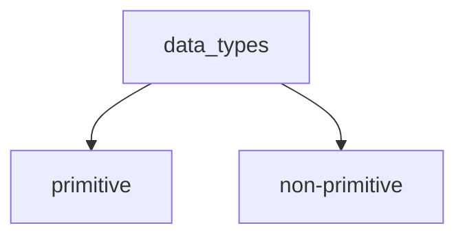
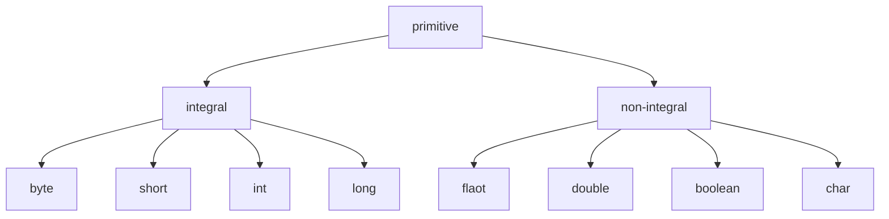

# Thing to Discuss

-------------------------------------------------


### data types
   - primitive
   - non-primitive
--------------------------------------



-------------------------

-----------------
### Primitive Types

| Data Type | Size    | Description                                                                       |
|-----------|---------|-----------------------------------------------------------------------------------|
| byte      | 1 byte  | Stores whole numbers from -128 to 127                                             |
| short     | 2 bytes | Stores whole numbers from -32,768 to 32,767                                       |
| int       | 4 bytes | Stores whole numbers from -2,147,483,648 to 2,147,483,647                         |
| long      | 8 bytes | Stores whole numbers from -9,223,372,036,854,775,808 to 9,223,372,036,854,775,807 |
| float     | 4 bytes | Stores fractional numbers. Sufficient for storing 6 to 7 decimal digits           |
| double    | 8 bytes | Stores fractional numbers. Sufficient for storing 15 decimal digits               |
| boolean   | 1 bit   | Stores true or false values                                                       |
| char      | 2 bytes | Stores a single character/letter or ASCII values                                  |


#### 1.The char primitive
A **char** can store a single 16-bit Unicode character. A character literal is enclosed in single quotes
  ```java
  char myChar = 'u';
  char myChar2 = '5';
  char myChar3 = 65; // myChar3 == 'A'

  ```

It is also possible to add to a char. e.g. to iterate through every lower-case letter, you could do to the following:


```java
for (int i = 0; i <= 26; i++) {
  char letter = (char) ('a' + i);
  System.out.println(letter);
}
```
### 2.The float primitive

A **float** is a single-precision 32-bit IEEE 754 floating point number. By default, decimals are interpreted as doubles.
To create a **float**, simply append an f to the decimal literal.
```java
double doubleExample = 0.5; // without 'f' after digits = double
float floatExample = 0.5f; // with 'f' after digits = float
float myFloat = 92.7f; // this is a float...
float positiveFloat = 89.3f; // it can be positive,
float negativeFloat = -89.3f; // or negative
float integerFloat = 43.0f; // it can be a whole number (not an int)
float underZeroFloat = 0.0549f; // it can be a fractional value less than 0
```

Floats handle the five common arithmetical operations: addition, subtraction, multiplication, division, and modulus.
```java
// addition
float result = 37.2f + -2.6f; // result: 34.6
// subtraction
float result = 45.1f - 10.3f; // result: 34.8
// multiplication
float result = 26.3f * 1.7f; // result: 44.71
// division
float result = 37.1f / 4.8f; // result: 7.729166
// modulus
float result = 37.1f % 4.8f; // result: 3.4999971
```


### 3.The int primitive
A primitive data type such as int holds values directly into the variable that is using it, meanwhile a variable that
was declared using **Integer** holds a reference to the value

The maximum and minimum values of int can be found at:
```java
int high = Integer.MAX_VALUE; // high == 2147483647
int low = Integer.MIN_VALUE; // low == -2147483648
```

The default value of an **int** is 0:
```java
int defaultInt; // defaultInt == 0
```


#### Converting Primitives

In **Java**, we can convert between **integer** values and floating-point values. Also, since every character 
corresponds to
a number in the Unicode encoding, char types can be converted to and from the integer and floating-point types.
boolean is the only primitive datatype that cannot be converted to or from any other primitive datatype.


> There are two types of conversions: widening conversion and narrowing conversion.

- A **widening conversion** is when a value of one datatype is converted to a value of another datatype that occupies
  more bits than the former. There is no issue of data loss in this case.
- A **narrowing conversion** is when a value of one datatype is converted to a value of another
  datatype that occupies fewer bits than the former. Data loss can occur in this case.


>Java performs widening conversions automatically. But if you want to perform a narrowing conversion (if you are sure
that no data loss will occur), then you can force Java to perform the conversion using a language construct known
as a cast.


##### Widening Conversion:
```java
int a = 1;
double d = a; // valid conversion to double, no cast needed (widening)
```

##### Narrowing Conversion:
```java
double d = 18.96
int b = d; // invalid conversion to int, will throw a compile-time error
int b = (int) d; // valid conversion to int, but result is truncated (gets rounded down)
 // This is type-casting
 // Now, b = 18
```
### Memory consumption of primitives vs. boxed primitives
Boxed objects always require 8 bytes for type and memory management, and because the size of objects is always
a multiple of 8, boxed types all require 16 bytes total. In addition, each usage of a boxed object entails storing a
reference which accounts for another 4 or 8 bytes, depending on the JVM and JVM options


| Primitive | Boxed Type | Memory Size of primitive / boxed |
|-----------|------------|----------------------------------|
| boolean   | Boolean    | 1 byte / 16 bytes                |
| byte      | Byte       | 1 byte / 16 bytes                |
| short     | Short      | 2 bytes / 16 bytes               |
| char      | Char       | 2 bytes / 16 bytes               |
| int       | Integer    | 4 bytes / 16 bytes               |
| long      | Long       | 8 bytes / 16 bytes               |
| float     | Float      | 4 bytes / 16 bytes               |
| double    | Double     | 8 bytes / 16 bytes               |


### 4.The double primitive
A **double** is a double-precision 64-bit IEEE 754 floating point number.
```java
double example = -7162.37;
double myDouble = 974.21;
double anotherDouble = 658.7;
double addedDoubles = myDouble + anotherDouble; // 315.51
double subtractedDoubles = myDouble - anotherDouble; // 1632.91
double scientificNotationDouble = 1.2e-3; // 0.0012
```
Because of the way floating point numbers are stored, many numbers don't have an exact representation:
```java
double notExact = 1.32 - 0.42; // result should be 0.9
System.out.println(notExact); // 0.9000000000000001
```

While using double is fine for most applications, neither **float nor double** should be used to store precise numbers
such as currency. Instead, the **BigDecimal** class should be used.
```java
double d1 = 0d;
double d2 = -0d;
System.out.println(d1 == d2); // true
System.out.println(1d / d1); // Infinity
System.out.println(1d / d2); // -Infinity
System.out.println(Double.POSITIVE_INFINITY / Double.POSITIVE_INFINITY); // NaN
```

#### 5.The long primitive:

By default, long is a 64-bit signed integer (in Java 8, it can be either signed or unsigned). Signed, it can store a
minimum value of -263, and a maximum value of 263 - 1, and unsigned it can store a minimum value of 0 and a
maximum value of 264 - 1.
```java
long example = -42;
long myLong = 284;
long anotherLong = 73;
//an "L" must be appended to the end of the number, because by default,
//numbers are assumed to be the int type. Appending an "L" makes it a long
//as 549755813888 (2 ^ 39) is larger than the maximum value of an int (2^31 - 1),
//"L" must be appended
long bigNumber = 549755813888L;
long addedLongs = myLong + anotherLong; // 284 + 73 = 357
long subtractedLongs = myLong - anotherLong; // 284 - 73 = 211
```

>The maximum and minimum values of long can be found at:
```java
long high = Long.MAX_VALUE; // high == 9223372036854775807L
long low = Long.MIN_VALUE; // low == -9223372036854775808L
```

The default value of a long is 0L:
```java
long defaultLong; // defaultLong == 0L
```

>Warning: Java caches Integer objects instances from the range -128 to 127. The reasoning is explained here:
[reason](https://blogs.oracle.com/darcy/entry/boxing_and_caches_integer_valueof)

The following results can be found:
```java
Long val1 = 127L;
Long val2 = 127L;
System.out.println(val1 == val2); // true
Long val3 = 128L;
Long val4 = 128L;
System.out.println(val3 == val4); // false
```
To properly compare 2 Object Long values, use the following code(From Java 1.7 onward):

```java
Long val3 = 128L;
Long val4 = 128L;
System.out.println(Objects.equal(val3, val4)); // true
```
### 6.The boolean primitive:
A **boolean** can store one of two values, either **true** or **false**

```java
boolean foo = true;
System.out.println("foo = " + foo); // foo = true
boolean bar = false;
System.out.println("bar = " + bar); // bar = false
boolean notFoo = !foo;
System.out.println("notFoo = " + notFoo); // notFoo = false
boolean fooAndBar = foo && bar;
System.out.println("fooAndBar = " + fooAndBar); // fooAndBar = false
boolean fooOrBar = foo || bar;
System.out.println("fooOrBar = " + fooOrBar); // fooOrBar = true
boolean fooXorBar = foo ^ bar;
System.out.println("fooXorBar = " + fooXorBar); // fooXorBar = true
```
> The default value of a boolean is false
```java
boolean defaultBoolean; // defaultBoolean == false
```

 ### 7.The byte primitive:
A **byte** is a 8-bit signed integer. It can store a minimum value of -27 (-128), and a maximum value of 27 - 1 (127).
```java
byte example = -36;
byte myByte = 96;
byte anotherByte = 7;
byte addedBytes = (byte) (myByte + anotherByte); // 103
byte subtractedBytes = (byte) (myBytes - anotherByte); // 89
```
The maximum and minimum values of byte can be found at:
```java
byte high = Byte.MAX_VALUE; // high == 127
byte low = Byte.MIN_VALUE; // low == -128
```
>The default value of a byte is 0


### 8.The short primitive:
A **short** is a 16-bit signed integer. It has a minimum value of -215 (-32,768), and a maximum value of 215 ‑1 (32,767).
```java
short example = -48;
short myShort = 987;
short anotherShort = 17;
short addedShorts = (short) (myShort + anotherShort); // 1,004
short subtractedShorts = (short) (myShort - anotherShort); // 970
```
The maximum and minimum values of short can be found at:
```java
short high = Short.MAX_VALUE; // high == 32767
short low = Short.MIN_VALUE; // low == -32768
```

The default value of a short is 0
```java
short defaultShort; // defaultShort == 0
```